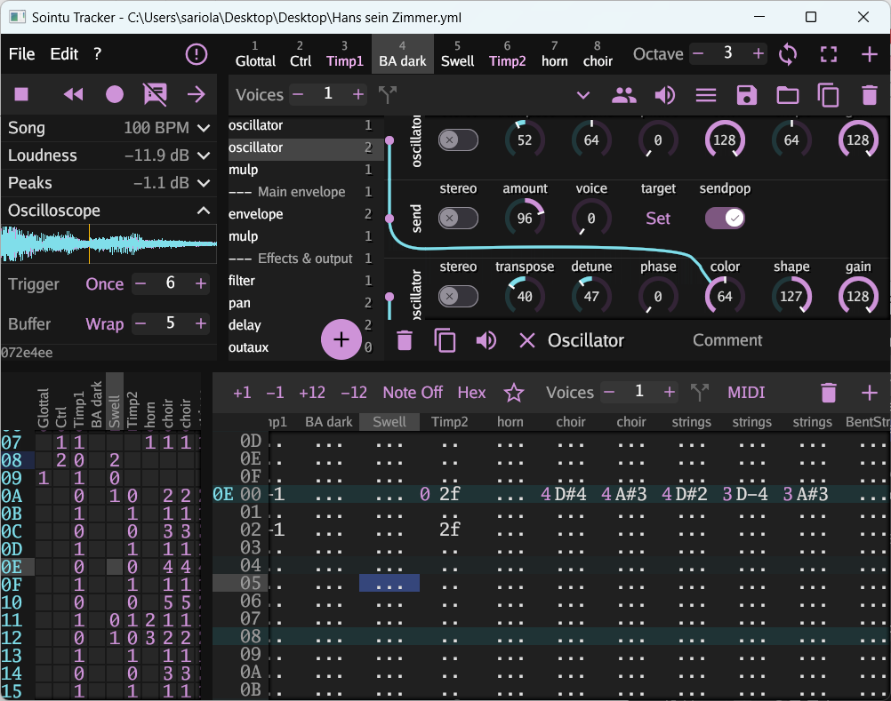

# Sointu


A cross-architecture and cross-platform modular software synthesizer for small
intros, forked from [4klang](https://github.com/hzdgopher/4klang). Targetable
architectures include 386, amd64, and WebAssembly; targetable platforms include
Windows, Mac, Linux (and related) + browser.

Pull requests / suggestions / issues welcome, through Github! You can also
contact me through email (firstname.lastname@gmail.com).

Summary
-------

Sointu is work-in-progress. It is a fork and an evolution of
[4klang](https://github.com/hzdgopher/4klang), a modular software synthesizer
intended to easily produce music for 4k intros &mdash; small executables with a
maximum filesize of 4096 bytes containing realtime audio and visuals. Like
4klang, the sound is produced by a virtual machine that executes small bytecode
to produce the audio; however, by now the internal virtual machine has been
heavily rewritten and extended. It is actually extended so much that you will
never fit all the features at the same time in a 4k intro, but a fairly capable
synthesis engine can already be fitted in 600 bytes (386, compressed), with
another few hundred bytes for the patch and pattern data.

Sointu consists of two core elements:
- A cross-platform synth-tracker app for composing music, written in
  [go](https://golang.org/). The app is still heavily work in progress. The app
  exports the projects as .yml files. There are two versions of the app:
  [cmd/sointu-track/](sointu-track), using a plain Go VM bytecode interpreter,
  and [cmd/sointu-nativetrack/](sointu-nativetrack), using cgo to bridge calls
  to the Sointu compiled VM. The former should be highly portable, the latter
  currently works only on x86/amd64 platforms.
- A compiler, likewise written in go, which can be invoked from the command line
  to compile these .yml files into .asm or .wat code. For x86/amd64, the
  resulting .asm can be then compiled by [nasm](https://www.nasm.us/) or
  [yasm](https://yasm.tortall.net). For browsers, the resulting .wat can be
  compiled by [wat2wasm](https://github.com/WebAssembly/wabt).

This is how the current prototype tracker looks like:



Building
--------

Various aspects of the project have different tool dependencies, which are
listed below.

### Sointu-track

This version of the tracker is the version that uses the bytecode interpreter
written in plain Go. Running the tracker:

```
go run cmd/sointu-track/main.go
```

Building the tracker:

```
go build -o sointu-track cmd/sointu-track/main.go
```

On windows, replace `-o sointu-track` with `-o sointu-track.exe`.

Sointu-track uses the [gioui](https://gioui.org/) for the GUI and
[oto](https://github.com/hajimehoshi/oto) for the audio, so the portability is
currently limited by these.

> :warning: Unlike the x86/amd64 VM compiled by Sointu, the Go written VM
> bytecode interpreter uses a software stack. Thus, unlike x87 FPU stack, it is
> not limited to 8 items. If you intent to compile the patch to x86/amd64
> targets, make sure not to use too much stack. Keeping at most 5 signals in the
> stack is presumably fine (reserving 3 for the temporary variables of the
> opcodes). In future, the app should give warnings if the user is about to
> exceed the capabilities of a target platform.

### Compiler

The command line interface to it is [sointu-compile](cmd/sointu-compile/main.go)
and the actual code resides in the [compiler](vm/compiler/) package, which is an
ordinary [go](https://golang.org/) package with no other tool dependencies.

Running the compiler:

```
go run cmd/sointu-compile/main.go
```

Building the compiler:

```
go build -o sointu-compile cmd/sointu-compile/main.go
```

or building it as a server where you can post yaml to the `/process` endpoint and get WAT in return:
```
go build -o sointu-server cmd/sointu-compile/server.go
```

On windows, replace `-o sointu-compile` with `-o sointu-compile.exe`.

The compiler can then be used to compile a .yml song into .asm and .h files. For
example:

```
sointu-compile -o . -arch=386 tests/test_chords.yml
nasm -f win32 test_chords.asm
```

WebAssembly example:

```
sointu-compile -o . -arch=wasm tests/test_chords.yml
wat2wasm --enable-bulk-memory test_chords.wat
```

Example using the server:

```
groove = `bpm: 120
rowsperbeat: 4
score:
  length: 24
  rowsperpattern: 16
  tracks:
    - numvoices: 1
      order:
        - 0
        - 0
        - 0
        - 0
        ......`;

fetch('http://localhost:8080/process', {
    method: 'POST',
    headers: {
        'content-type': 'application/json'
    },
    body: JSON.stringify({content: groove})
});
```

### Building and running the tests as executables

Building the [regression tests](tests/) as executables (testing that they work
the same way when you would link them in an intro) requires:
- [go](https://golang.org/)
- [CMake](https://cmake.org) with CTest
- [nasm](https://www.nasm.us/) or [yasm](https://yasm.tortall.net)
- Your favorite CMake compatible c-compiler & build tool. Results have been
  obtained using Visual Studio 2019, gcc&make on linux, MinGW&mingw32-make, and
  ninja&AppleClang.

For example, using [ninja](https://ninja-build.org/):

```
mkdir build
cd build
cmake .. -GNinja
ninja
ninja test
```

Note that this builds 64-bit binaries on 64-bit Windows. To build 32-bit
binaries on 64-bit Windows, replace in above:

```
cmake .. -DCMAKE_C_FLAGS="-m32" -DCMAKE_ASM_NASM_OBJECT_FORMAT="win32" -GNinja
```

Another example: on Visual Studio 2019 Community, just open the folder, choose
either Debug or Release and either x86 or x64 build, and hit build all.

### Native bridge & sointu-nativetrack

The native bridge allows Go to call the sointu compiled virtual machine, through
cgo, instead of using the Go written bytecode interpreter. It's likely slightly
faster than the interpreter. The version of the tracker that uses the native
bridge is [sointu-nativetrack](cmd/sointu-nativetrack/). Before you can actually
run it, you need to build the bridge using CMake (thus, the nativetrack does not
work with go get)

Building the native bridge requires:
- [go](https://golang.org/)
- [CMake](https://cmake.org)
- [nasm](https://www.nasm.us/) or [yasm](https://yasm.tortall.net)
- *cgo compatible compiler* e.g. [gcc](https://gcc.gnu.org/). On windows, you
  best bet is [MinGW](http://www.mingw.org/). We use the
  [tdm-gcc](https://jmeubank.github.io/tdm-gcc/)

The last point is because the command line player and the tracker use
[cgo](https://golang.org/cmd/cgo/) to interface with the synth core, which is
compiled into a library. The cgo bridge resides in the package
[bridge](vm/compiler/bridge/).

> :warning: *you must build the library inside a directory called 'build' at the
> root of the project*. This is because the path where cgo looks for the library
> is hard coded to point to build/ in the go files.

So, to build the library, run (this example is using
[ninja](https://ninja-build.org/) for the build; adapt for other build tools
accordingly):

```
mkdir build
cd build
cmake .. -GNinja
ninja sointu
```

Running `ninja sointu` only builds the static library that Go needs. This is a
lot faster than building all the CTests.

You and now run all the Go tests, even the ones that test the native bridge.
From the project root folder, run:

```
go test ./...
```

Play a song from the command line:
```
go run cmd/sointu-play/main.go tests/test_chords.yml
```

Run the tracker using the native bridge
```
go run cmd/sointu-nativetrack/main.go
```

> :warning: **If you are using MinGW and Yasm**: Yasm 1.3.0 (currently still the
> latest stable release) and GNU linker do not play nicely along, trashing the
> BSS layout. See
> [here](https://tortall.lighthouseapp.com/projects/78676/tickets/274-bss-problem-with-windows-win64)
> and the fix
> [here](https://github.com/yasm/yasm/commit/1910e914792399137dec0b047c59965207245df5).
> Use a newer nightly build of yasm that includes the fix. The linker had placed
> our synth object overlapping with DLL call addresses; very funny stuff to
> debug.

> :warning: The sointu-nativetrack cannot be used with the syncs at the moment.
> For syncs, use the Go VM (sointu-track).

### Building and running the WebAssembly tests

These are automatically invoked by CTest if [node](https://nodejs.org) and
[wat2wasm](https://github.com/WebAssembly/wabt) are found in the path.

New features since fork
-----------------------
  - **New units**. For example: bit-crusher, gain, inverse gain, clip, modulate
    bpm (proper triplets!), compressor (can be used for side-chaining).
  - **Compiler**. Written in go. The input is a .yml file and the output is an
    .asm. It works by inputting the song data to the excellent go
    `text/template` package, effectively working as a preprocessor. This allows
    quite powerful combination: we can handcraft the assembly code to keep the
    entropy as low as possible, yet we can call arbitrary go functions as
    "macros". The templates are [here](templates/) and the compiler lives
    [here](vm/compiler/).
  - **Tracker**. Written in go. A crude version exists.
  - **Supports 32 and 64 bit builds**. The 64-bit version is done with minimal
    changes to get it work, using template macros to change the lines between
    32-bit and 64-bit modes. Mostly, it's as easy as writing {{.AX}} instead of
    eax; the macro {{.AX}} compiles to eax in 32-bit and rax in 64-bit.
  - **Supports compiling into WebAssembly**. This is a complete reimplementation
    of the core, written in WebAssembly text format (.wat).
  - **Supports Windows, Linux and MacOS**. On all three 64-bit platforms, all
    tests are passing. Additionally, all tests are passing on windows 32.
  - **Per instrument polyphonism**. An instrument has the possibility to have
    any number of voices, meaning that multiple voices can reuse the same
    opcodes. So, you can have a single instrument with three voices, and three
    tracks that use this instrument, to make chords. See
    [here](tests/test_chords.yml) for an example and
    [here](templates/amd64-386/patch.asm) for the implementation. The maximum
    total number of voices is 32: you can have 32 monophonic instruments or any
    combination of polyphonic instruments adding up to 32.
  - **Any number of voices per track**. A single track can trigger more than one
    voice. At every note, a new voice from the assigned voices is triggered and
    the previous released. Combined with the previous, you can have a single
    track trigger 3 voices and all these three voices use the same instrument,
    useful to do polyphonic arpeggios (see [here](tests/test_polyphony.yml)).
    Not only that, a track can even trigger voices of different instruments,
    alternating between these two; maybe useful for example as an easy way to
    alternate between an open and a closed hihat.
  - **Easily extensible**. Instead of %ifdef hell, the primary extension
    mechanism is through new opcodes for the virtual machine. Only the opcodes
    actually used in a song are compiled into the virtual machine. The goal is
    to try to write the code so that if two similar opcodes are used, the common
    code in both is reused by moving it to a function. Macro and linker magic
    ensure that also helper functions are only compiled in if they are actually
    used.
  - **Songs are YAML files**. These markup files are simple data files,
    describing the tracks, patterns and patch structure (see
    [here](tests/test_oscillat_trisaw.yml) for an example). The sointu-compile
    then reads these files and compiles them into .asm code. This has the nice
    implication that, in future, there will be no need for a binary format to
    save patches, nor should you need to commit .o or .asm to repo: just put the
    .yml in the repo and automate the .yml -> .asm -> .o steps using
    sointu-compile & nasm.
  - **Harmonized support for stereo signals**. Every opcode supports a stereo
    variant: the stereo bit is hidden in the least significant bit of the
    command stream and passed in carry to the opcode. This has several nice
    advantages: 1) the opcodes that don't need any parameters do not need an
    entire byte in the value stream to define whether it is stereo; 2) stereo
    variants of opcodes can be implemented rather efficiently; in some cases,
    the extra cost of stereo variant is only 5 bytes (uncompressed). 3) Since
    stereo opcodes usually follow stereo opcodes (and mono opcodes follow mono
    opcodes), the stereo bits of the command bytes will be highly correlated and
    if crinkler or any other modeling compressor is doing its job, that should
    make them highly predictable i.e. highly compressable.
  - **Test-driven development**. Given that 4klang was already a mature project,
    the first thing actually implemented was a set of regression tests to avoid
    breaking everything beyond any hope of repair. Done, using go test (runs the
    .yml regression tests through the library) and CTest (compiles each .yml
    into executable and ensures that when run like this, the test case produces
    identical output). The tests are also ran in the cloud using github actions.
  - **Arbitrary signal routing**. SEND (used to be called FST in 4klang) opcode
    normally sends the signal as a modulation to another opcode. But with the
    new RECEIVE opcode, you just receive the plain signal there. So you can
    connect signals in an arbitrary way. Actually, 4klang could already do this
    but in a very awkward way: it had FLD (load value) opcode that could be
    modulated; FLD 0 with modulation basically achieved what RECEIVE does,
    except that RECEIVE can also handle stereo signals. Additionally, we have
    OUTAUX, AUX and IN opcodes, which route the signals through global main or
    aux ports, more closer to how 4klang does. But this time we have 8 mono
    ports / 4 stereo ports, so even this method of routing is unlikely to run
    out of ports in small intros.
  - **Pattern length does not have to be a power of 2**.
  - **Sample-based oscillators, with samples imported from gm.dls**. Reading
    gm.dls is obviously Windows only, but with some effort the sample mechanism
    can be used also without it, in case you are working on a 64k and have some
    kilobytes to spare. See [this example](tests/test_oscillat_sample.yml), and
    this go generate [program](cmd/sointu-generate/main.go) parses the gm.dls
    file and dumps the sample offsets from it.
  - **Unison oscillators**. Multiple copies of the oscillator running slightly
    detuned and added up to together. Great for trance leads (supersaw). Unison
    of up to 4, or 8 if you make stereo unison oscillator and add up both left
    and right channels. See [this example](tests/test_oscillat_unison.yml).
  - **Compiling as a library**. The API is very rudimentary, a single function
    render, and between calls, the user is responsible for manipulating the
    synth state in a similar way as the actual player does (e.g. triggering/
    releasing voices etc.)
  - **Calling Sointu as a library from Go language**. The Go API is slighty more
    sane than the low-level library API, offering more Go-like experience.
  - **A bytecode interpreter written in pure go**. It's slightly slower than the
    hand-written assembly code by sointu compiler, but with this, the tracker is
    ultraportable and does not need cgo calls.
  - **Using Sointu as a sync-tracker**. Similar to [GNU
    Rocket](https://github.com/rocket/rocket), but (ab)using the tracker we
    already have for music. We use the Go rpc package to send current sync
    values from the new SYNC opcode + optionally the current fractional row the
    song is on. The syncs are saved every 256th sample (approximately 172 Hz).
    For 4k intro development, the idea is to write a debug version of the intro
    that merely loads the shader and listens to the RPC messages, and then draws
    the shader with those as the uniforms. Then, during the actual 4k intro, one
    can get the sync data from Sointu: if the song uses syncs, su_render_song
    writes the syncs to a float array. During each time step, a slice of this
    array can be sent to the shader as a uniform float array. A track with two
    voices, triggering an instrument with a single envelope and a slow filter,
    can even be used as a cheap smooth interpolation mechanism, provided the
    syncs are added to each other in the shader.

Future goals
------------

  - **Find a more general solution for skipping opcodes / early outs**. It might
    be a new opcode "skip" that skips from the opcode to the next out in case
    the signal entering skip and the signal leaving out are both close to zero.
    Need to investigate the best way to implement this.
  - **Even more opcodes**. Some potentially useful additions could be:
    - Equalizer / more flexible filters
    - Very slow filters (~ DC-offset removal). Can be implemented using a single
      bit flag in the existing filter
    - Arbitrary envelopes; for easier automation.
  - **MIDI support for the tracker**.
  - **Find a solution for denormalized signals**. Denormalized floating point
    numbers (floating point numbers that are very very small) can result in 100x
    CPU slow down. We got hit by this already: the damp filters in delay units
    were denormalizing, resulting in the synth being unusable in real time. Need
    to investigate a) where denormalization can happen; b) how to prevent it:
    add & substract value; c) make this optional to the user. For quick
    explanation about the potential massive CPU hit, see
    https://stackoverflow.com/questions/36781881/why-denormalized-floats-are-so-much-slower-than-other-floats-from-hardware-arch

Long-shot ideas
-----------
  - **Hack deeper into audio sources from the OS**. Speech synthesis, I'm eyeing
    at you.
  - **Ability to run Sointu as a DAW plugin (VSTi3)**. Now that Renoise supports
    VSTi3, there's no fundamental objection to compiling Sointu as a VSTi3. But
    don't expect it any soon; I need to digest the idea of having to learn the
    horrors of the VSTi3 C++ API.

Design philosophy
-----------------

  - Make sure the assembly code is readable after compiling: it should have
    liberally comments *in the outputted .asm file*. This allows humans to study
    the outputted code and figure out more easily if there's still way to
    squeeze out instructions from the code.
  - Instead of prematurely adding %ifdef toggles to optimize away unused
    features, start with the most advanced featureset and see if you can
    implement it in a generalized way. For example, all the modulations are now
    added into the values when they are converted from integers, in a
    standardized way. This got rid of most of the %ifdefs in 4klang. Also, with
    no %ifdefs cluttering the view, many opportunities to shave away
    instructions became apparent. Also, by making the most advanced synth
    cheaply available to the scene, we promote better music in future 4ks :)
  - Size first, speed second. Speed will only considered if the situation
    becomes untolerable.
  - Benchmark optimizations. Compression results are sometimes slightly
    nonintuitive so alternative implementations should always be benchmarked
    e.g. by compiling and linking a real-world song with
    [Leviathan](https://github.com/armak/Leviathan-2.0) and observing how the
    optimizations affect the byte size.

Background and history
----------------------

[4klang](https://github.com/hzdgopher/4klang) development was started in 2007 by
Dominik Ries (gopher) and Paul Kraus (pOWL) of Alcatraz. The
[write-up](http://zine.bitfellas.org/article.php?zine=14&id=35) will still be
helpful for anyone looking to understand how 4klang and Sointu use the FPU stack
to manipulate the signals. Since then, 4klang has been used in countless of
scene productions and people use it even today.

However, 4klang seems not to be actively developed anymore and polyphonism was
implemented only in a rather limited way (you could have exactly 2 voices per
instrument if you enable it). Also, reading through the code, I spotted several
avenues to squeeze away more bytes. These observations triggered project Sointu.
That, and I just wanted to learn x86 assembly, and needed a real-world project
to work on.

What's with the name
--------------------

"Sointu" means a chord, in Finnish; a reference to the polyphonic capabilities
of the synth. I assume we have all learned by now what "klang" means in German,
so I thought it would fun to learn some Finnish for a change. And
[there's](https://www.pouet.net/prod.php?which=53398)
[enough](https://www.pouet.net/prod.php?which=75814)
[klangs](https://www.pouet.net/prod.php?which=85351) already.

Prods using Sointu
------------------

[Adam](https://github.com/vsariola/adam) by brainlez Coders! - My first test-driving of Sointu. Some ideas how to integrate Sointu to the build chain.

Credits
-------

The original 4klang was developed by Dominik Ries
([gopher](https://github.com/hzdgopher/4klang)) and Paul Kraus (pOWL) of
Alcatraz. :heart:

Sointu was initiated by Veikko Sariola (pestis/bC!).

Apollo/bC! put the project on the path to Go, and wrote the prototype of the
tracker GUI.

PoroCYon's [4klang fork](https://github.com/PoroCYon/4klang) inspired the macros
for better cross-platform support.
